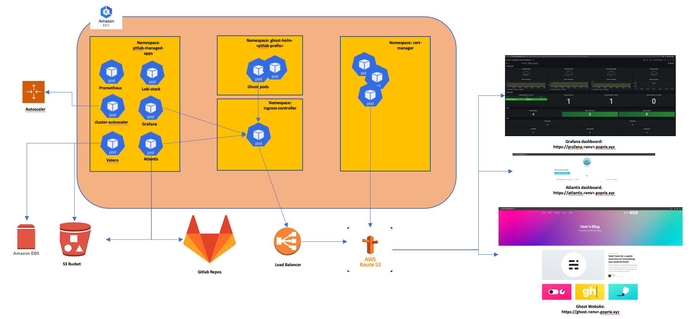
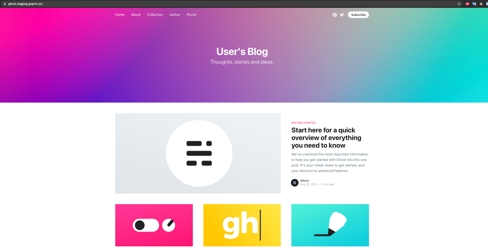

# Ghost-helm

This is a proof of concept for the customer Drone Shuttles Ltd to launch their website using Ghost. 
The repo will help you to deploy a website using Ghost into an AWS Managed Kubernetes cluster(EKS).
In this repo we have:
- gitlab-ci.yaml to deploy ghost application 
- nginx ingress to expose ghost outside eks cluster
- horizontal pod autoscaler kubernetes manifest file to scale ghost based on different traffic spikes

There are other repos which will help in automating the deployment of the whole infrastructure used for the website
- [eks-tf](https://gitlab.com/nord-cloud-ghost/eks-tf) - Terraform(IaC) code base to deploy EKS cluster 
- [eks-addons](https://gitlab.com/nord-cloud-ghost/eks-addons) - Helm chart code base to deploy addons on EKS cluster for monitoring and visualising Ghost app and its environments
- [ghost-infra](https://gitlab.com/nord-cloud-ghost/ghost-infra) - Terraform code base to deploy serverless function related to Ghost application

## Assumptions:

- Customer is in AWS region: ```us-east-1```
- User/Dev has an AWS account with programmatic access
- User/Dev has prior knowledge of:
   - Terraform
   - AWS CLI
   - Using EKS cluster

## Prerequisites:
To Setup the entire project following tools are needed:

- Terraform - v0.14.8
- Kubectl
- AWS CLI Configured with right credentials
- S3 bucket to store terraform state file
- A DynamoDB table to store the lock information for terraform  
- Route53 Hosted zones   

## Architecture Overview

Shows overview of ghost deployment in EKS cluster


## Infrastructure

To support development efforts three different environments (Dev, Staging, Prod) will be created in AWS and each environment mainly consists of the following stack:

- VPC (with private and public subnet) - Networking
- EKS cluster - For hosting ghost application and its support services
- Route53 records - DNS service
- Lambda function - To support customer with serverless function to delete all posts in ghost
- Gitlab - For storing code and CI/CD
- S3 buckets - For storing terraform state files and creating backups for eks cluster
- IAM - For user and access management
- DynamoDB - For storing terraform state Lock information
- Prometheus - For scraping metrics
- Grafana - For visualizing and monitoring
- Loki - For log aggregation
- Cloud trail - For audit logs
- Velero - For Disaster recovery
- Atlantis - For automating terraform workflow through gitlab 
- Cert-manager - For Issuing certificated 
- Nginx Ingress Controller - For routing traffic outside or within the cluster 
- Autoscaling group - For deploying autoscaling for eks worker nodes in case of high traffic spikes 

All the environments will be managed by three different accounts within AWS for separation of concerns.

All EKS clusters will be integrated in the gitlab repos, so it can be used with CI/CD. Below are the cluster names that needs to be assigned for each environment:

3. Dev     - ```dev-eks```
1. Staging - ```staging-eks```
2. Prod    - ```prod-eks```

## Deployment

Shows overview of Deployment


### Deploying Infrastructure

1. Configure AWS cli with a IAM user which has programmatic and admin access

2. Website will be hosted in an EKS cluster, so go to repo: - [eks-tf](https://gitlab.com/nord-cloud-ghost/eks-tf) and follow instructions to
   deploy the following infrastructure using terraform:
   - EKS cluster
   - Security groups for creating firewalls for the EKS cluster
   - VPC
   - IAM Roles using OIDC provider to provide necessary access to Velero, Cert-manager and Atlantis
   - Deployment of Cert-manager on EKS cluster using helm chart
   - Deployment of Nginx Ingress controller on EKS cluster using helm chart
   - Route53 CNAME records to route Outside traffic to Nginx Ingress controller
   - Deploy a service account and clusterrolebindings to provide admin access to gitlab
   
   Once the EKS cluster is successfully created use the below command to add kubeconfig to your context:
   ```shell
   aws eks --region us-east-1 update-kubeconfig --name <env>-eks
   ```
   for example: 
   ```shell
   aws eks --region us-east-1 update-kubeconfig --name staging-eks
   ```
   
3. Integrate/Add EKS cluster to gitlab. 

   As the solution is spread across different repos within a group in gitlab, 
   we will add EKS cluster as a group level cluster following the instructions 
   from gitlab documentation [here](https://docs.gitlab.com/ee/user/project/clusters/add_existing_cluster.html#how-to-add-an-existing-cluster).
   
   Following settings are recommended:
   - Fetch API URL using AWS Console
   - Fetch CA certificate again from AWS console and decode it before using it
   ```shell
   echo <COPY-ENCODED-CA-CERTIFICATE> | base64 --decode
   ```
   - A service account which has admin access is already created while setting up the cluster. So you can skip the creation of service account and clusterrolebindings and 
     directly fetch token using the following command:
   ```shell
   kubectl -n kube-system describe secret $(kubectl -n kube-system get secret | grep gitlab | awk '{print $1}')
   ```
   - DO NOT DISABLE RBAC settings
   - Let gitlab manage your eks cluster
   
4. After integrating the cluster, use the repo [eks-addons](https://gitlab.com/nord-cloud-ghost/eks-addons), to deploy EKS addons which help to monitor the cluster and website hosted by ghost.
   [Eks-addons](https://gitlab.com/nord-cloud-ghost/eks-addons) repo has a gitlab pipeline which can be used to deploy the addons in each environment. Further instruction can be looked in the repo.
   
Following above steps should successfully help in deploying infrastructure for hosting website using Ghost


### Deploying Website

Ghost is chosen for website creation as per customer requirements, so a helm chart will be used to deploy ghost onto EKS cluster.

Installation is automated to different environments using gitlab-ci pipeline in this repo. A branch strategy is used to enable or disable a particular job, for example ```dev```
related jobs can only be triggered in ```dev``` tagged branches, similarly, production related jobs can be enabled in ```production``` tagged branches, whereas staging related jobs can be triggered in both ```main/production``` tagged branches 

There are six different jobs which can be used to install/uninstall Ghost on eks cluster. So trigger the pipeline in gitlab repo to deploy ghost onto an environment

For Reference, click on the play button shown in the picture to deploy ghost on eks cluster in staging:


#### List of Jobs

All the jobs in the pipeline are manual except ```deploy-dev``` and use both kubectl and helm to install and uninstall ghost on different eks clusters

1. ```deploy-dev```         - to install ghost to dev eks cluster
2. ```undeploy-dev```       - to uninstall ghost on dev eks cluster
3. ```deploy-staging```     - to install ghost to staging eks cluster
4. ```undeploy-staging```   - to uninstall ghost on staging eks cluster
5. ```deploy-prod```        - to install ghost to prod eks cluster
6. ```undeploy-prod```      - to uninstall ghost on prod eks cluster

## Accessing Ghost

After successful installation of Ghost app on EKS cluster, following information can be used to access the website on internet:

1. Get the Ghost URL by running:

   - Blog URL  : ```http://ghost.<env>.goprix.xyz/```
   - Admin URL : ```http://ghost.<env>.goprix.xyz/ghost```
   
   For example to access Ghost on prod:

   - Blog URL  : ```http://ghost.prod.goprix.xyz/```
   - Admin URL : ```http://ghost.prod.goprix.xyz/ghost```

2. Get your Ghost login credentials by using:

   - Email: ```gopikrishna@goprix.xyz```
   - To extract password:
    ```shell
    $(kubectl get secret staging-ghost -o jsonpath="{.data.ghost-password}" | base64 --decode)
    ```

Below shows overview of EKS workloads interaction with AWS Services once the whole solution is deployed



## Deploying Serverless function

As per customer needs, a serverless function is built using AWS lambda function and python which is deployed using terraform in the repo: [ghost-infra](https://gitlab.com/nord-cloud-ghost/ghost-infra)

Currently, there is no way to trigger the function except for AWS Console.

AWS Lambda function contains python code and it is uses [Ghost API](https://ghost.org/docs/admin-api/) functionality to delete all posts on ghost application 

#### Note: Password needs to be reset before running the lambda function

## Identity and Access Management

Three different aws accounts will be created to manage each environment respectively.

Each account has two different groups

- devops - Admin access given, as they are tasked with maintaining and debugging the state of the environment
- security - Read access given, as they need visibility into the platform and its operations

All the users in devops team should be added to the group devops and all the users in security should be added to security group

### Security

As security is considered to be one of the pillar in this whole architecture, following steps are taken to make the infrastructure secure:

1. Credentials related to Ghost app are created dynamically during the pipeline and then assigned in the app using helm. Following command is used for dynamic assignment of credentials:
   ```shell 
   openssl rand -base64 12
   ```
2. An IAM assume role is created for all the EKS addons which interact with AWS services such as Velero, Cert-manager and Atlantis. As per the AWS [documentation](https://docs.aws.amazon.com/eks/latest/userguide/iam-roles-for-service-accounts.html), this is considered to be good design practice

3. EKS Cluster created is private cluster and is enabled with KMS encryption for secrets

4. All the applications which are exposed to internet using a FQDN are SSL enabled. 
   Cert-manager adds certificates and certificate issuers as resource types in cluster, and simplifies the process of obtaining, renewing and using those certificates for the applications below:
   - Ghost - ```https://ghost.env.goprix.xyz/```
   - Grafana - ```https://atlantis.env.goprix.xyz/```
   - Atlantis - ```https://grafana.env.goprix.xyz/```
   
## Backup and Disaster Recovery for EKS

Ghost will be deployed using AWS managed kubernetes cluster(EKS). 
Should there be a disaster, and the whole kubernetes cluster goes unavailable, 
then Velero deployed inside the EKS cluster will be used to recover all the workloads upon recreating the EKS cluster.

Velero is used to take snapshots of the cluster workloads and stores it in both S3 and EBS snapshots.

Following steps can be followed for disaster recovery:
### Prerequisites: 
- Make sure to have access to EKS cluster and Velero installed on your local

### Steps to recover from disaster:

1. To create periodical snapshots of the cluster, a schedule job can be created using velero. 
To achieve that, a simple EC2 instance which has access to EKS cluster and velero cli installed, then below command can be executed:

```shell 
velero schedule create <SCHEDULE NAME> --schedule "0 7 * * *"
```
This creates a Backup object with the name ```<SCHEDULE NAME>-<TIMESTAMP>```. The default backup retention period, expressed as TTL (time to live), is 30 days (720 hours); you can use the --ttl ```<DURATION>``` flag to change this as necessary

2. A disaster happens and you need to recreate your workloads on EKS cluster
3. After installing a new EKS cluster, deploy velero by configuring to same backup storage location, but this time with read-only access

```shell
kubectl patch backupstoragelocation <STORAGE LOCATION NAME> \
   --namespace velero \
   --type merge \
   --patch '{"spec":{"accessMode":"ReadOnly"}}'
```
4. Execute the command below to restore the snapshots

```shell
velero restore create --from-backup <SCHEDULE NAME>-<TIMESTAMP>
```

5. When ready, revert your backup storage location to read-write mode:

```shell
kubectl patch backupstoragelocation <STORAGE LOCATION NAME> \
   --namespace velero \
   --type merge \
   --patch '{"spec":{"accessMode":"ReadWrite"}}'
```

## Appendix

1. Screenshots of Website on Ghost application
   

2. Screenshots of Ghost App monitoring on Grafana

   

3. Screenshots of logs monitoring on Grafana using Loki

   